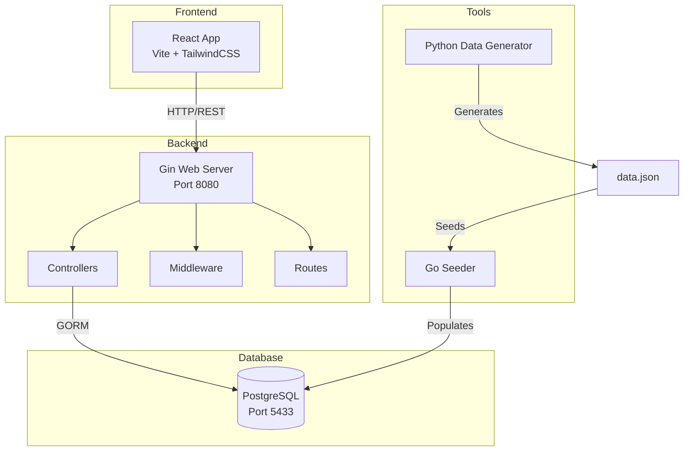
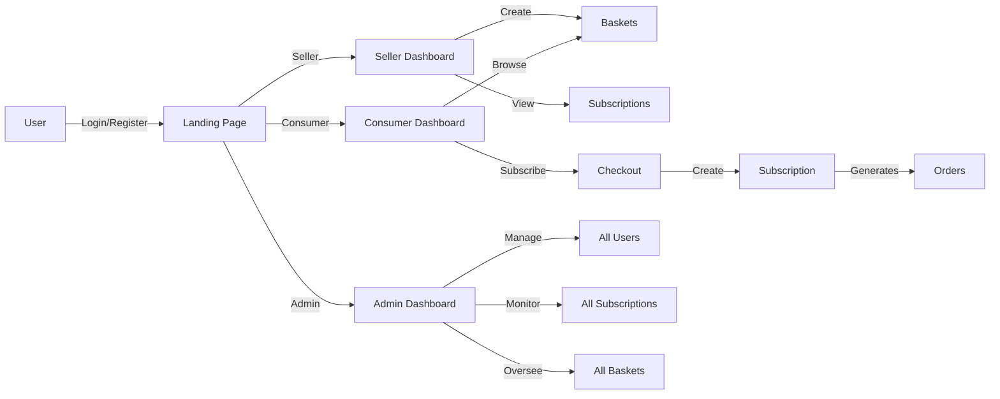
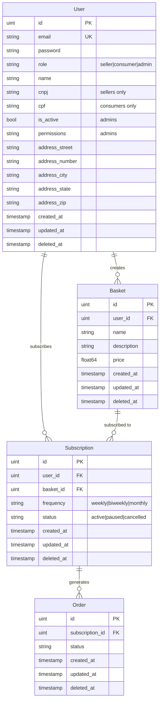

# Hoby Loop

A subscription-based marketplace platform connecting sellers (producers) with consumers through recurring basket deliveries. Built with Go (Gin) backend and React (Vite) frontend.

## 📋 Table of Contents

- [Overview](#overview)
- [Architecture](#architecture)
- [Project Structure](#project-structure)
- [Technology Stack](#technology-stack)
- [Database Schema](#database-schema)
- [API Endpoints](#api-endpoints)
- [Getting Started](#getting-started)
- [Development Tools](#development-tools)
- [User Roles](#user-roles)

## 🎯 Overview

Hoby Loop is a marketplace platform that enables:
- **Sellers** to create and manage product baskets
- **Consumers** to subscribe to recurring deliveries
- **Admins** to oversee the entire platform

The platform supports subscription-based commerce with flexible delivery frequencies (weekly, bi-weekly, monthly).

## 🏗️ Architecture

### System Architecture



### Application Flow



## 📁 Project Structure

```
hoby-loop/
├── cmd/                          # Command-line applications
│   └── seeder/                   # Database seeder utility
│       └── main.go              # Seeds database from JSON
│
├── config/                       # Configuration files
│   └── database.go              # Database connection config
│
├── internal/                     # Private application code
│   ├── controllers/             # Request handlers
│   │   ├── admin_controller.go  # Admin operations
│   │   ├── basket_controller.go # Basket CRUD
│   │   ├── order_controller.go  # Order management
│   │   ├── subscription_controller.go
│   │   └── user_controller.go   # Auth & user management
│   │
│   ├── database/                # Database layer
│   │   └── db.go               # GORM initialization & migrations
│   │
│   ├── middleware/              # HTTP middleware
│   │   ├── auth.go             # Authentication & authorization
│   │   └── response.go         # Standardized API responses
│   │
│   └── routes/                  # Route definitions
│       └── routes.go           # All API endpoints
│
├── models/                      # Data models
│   └── models.go               # User, Basket, Subscription, Order
│
├── frontend/                    # React application
│   ├── src/
│   │   ├── components/         # Reusable UI components
│   │   │   ├── layout/        # Layout components
│   │   │   └── ui/            # UI primitives (Button, Input)
│   │   │
│   │   ├── pages/             # Page components
│   │   │   ├── Landing.jsx
│   │   │   ├── Login.jsx
│   │   │   ├── SellerDashboard.jsx
│   │   │   ├── SellerRegistration.jsx
│   │   │   ├── ConsumerDashboard.jsx
│   │   │   ├── ConsumerCheckout.jsx
│   │   │   ├── SubscriberRegistration.jsx
│   │   │   ├── AdminDashboard.jsx
│   │   │   └── ConfigPage.jsx
│   │   │
│   │   ├── config/            # Frontend configuration
│   │   │   └── api.js        # API endpoints & base URL
│   │   │
│   │   ├── i18n/             # Internationalization
│   │   │   ├── index.js      # i18n utilities
│   │   │   └── pt-BR.js      # Portuguese translations
│   │   │
│   │   ├── utils/            # Utility functions
│   │   │   └── auth.js       # Authentication helpers
│   │   │
│   │   ├── styles/           # Global styles
│   │   │   └── colors.css    # Color variables
│   │   │
│   │   ├── App.jsx           # Main app component & routing
│   │   └── main.jsx          # React entry point
│   │
│   ├── public/               # Static assets
│   ├── index.html           # HTML template
│   ├── vite.config.js       # Vite configuration
│   ├── tailwind.config.js   # TailwindCSS configuration
│   └── package.json         # Frontend dependencies
│
├── tools/                    # Development tools
│   ├── generate.py          # Python script to generate mock data
│   ├── data.json           # Generated seed data
│   ├── pyproject.toml      # Python dependencies (uv)
│   └── README.md
│
├── main.go                  # Application entry point
├── go.mod                   # Go dependencies
└── go.sum                   # Go dependency checksums
```

## 🛠️ Technology Stack

### Backend
- **Language**: Go 1.24.5
- **Web Framework**: [Gin](https://github.com/gin-gonic/gin) v1.11.0
- **ORM**: [GORM](https://gorm.io/) v1.31.1
- **Database Driver**: PostgreSQL (pgx v5)
- **CORS**: gin-contrib/cors v1.7.6

### Frontend
- **Framework**: React 19.2.0
- **Build Tool**: Vite 7.2.4
- **Routing**: React Router DOM v7.10.1
- **HTTP Client**: Axios v1.13.2
- **Styling**: TailwindCSS v4.1.18
- **Language**: JavaScript (ES Modules)

### Database
- **DBMS**: PostgreSQL
- **Port**: 5433
- **Database Name**: hobyloop
- **User**: hoby

### Development Tools
- **Data Generation**: Python with Faker library
- **Package Manager (Python)**: uv
- **Linting**: ESLint v9.39.1

## 🗄️ Database Schema

### Entity Relationship Diagram



### Models

#### User Model
Located in [`models/models.go`](models/models.go:8)

```go
type User struct {
    gorm.Model
    Email         string  // Unique identifier
    Password      string  // Stored securely (not returned in JSON)
    Role          string  // "seller", "consumer", or "admin"
    Name          string
    CNPJ          string  // Business ID (sellers only)
    CPF           string  // Personal ID (consumers only)
    IsActive      bool    // Admin account status
    Permissions   string  // JSON string of admin permissions
    AddressStreet string
    AddressNumber string
    AddressCity   string
    AddressState  string
    AddressZip    string
}
```

#### Basket Model
Located in [`models/models.go`](models/models.go:32)

```go
type Basket struct {
    gorm.Model
    Name        string
    Description string
    Price       float64
    UserID      uint  // Foreign key to User (seller)
}
```

#### Subscription Model
Located in [`models/models.go`](models/models.go:41)

```go
type Subscription struct {
    gorm.Model
    UserID    uint    // Foreign key to User (consumer)
    User      User    // Relationship
    BasketID  uint    // Foreign key to Basket
    Basket    Basket  // Relationship
    Frequency string  // "weekly", "biweekly", "monthly"
    Status    string  // "active", "paused", "cancelled"
}
```

#### Order Model
Located in [`models/models.go`](models/models.go:52)

```go
type Order struct {
    gorm.Model
    SubscriptionID uint
    Subscription   Subscription
    Status         string
}
```

## 🔌 API Endpoints

Base URL: `http://localhost:8080`

### Authentication & Users

| Method | Endpoint | Description | Auth Required |
|--------|----------|-------------|---------------|
| POST | `/login` | Authenticate user by email | No |
| POST | `/register` | Register new seller or consumer | No |
| PUT | `/users/:id` | Update user profile | Yes |

### Baskets

| Method | Endpoint | Description | Auth Required |
|--------|----------|-------------|---------------|
| POST | `/baskets` | Create new basket | Yes (Seller) |
| GET | `/baskets/:id` | Get basket details | No |
| GET | `/sellers/:id/baskets` | Get all baskets for a seller | No |

### Subscriptions

| Method | Endpoint | Description | Auth Required |
|--------|----------|-------------|---------------|
| POST | `/subscriptions` | Create new subscription | Yes (Consumer) |
| GET | `/sellers/:id/subscriptions` | Get subscriptions for seller's baskets | Yes (Seller) |
| GET | `/users/:id/subscriptions` | Get user's subscriptions | Yes (Consumer) |

### Orders

| Method | Endpoint | Description | Auth Required |
|--------|----------|-------------|---------------|
| POST | `/orders` | Create new order | Yes |

### Admin Routes

All admin routes require admin role authentication.

| Method | Endpoint | Description | Auth Required |
|--------|----------|-------------|---------------|
| GET | `/admin/users` | Get all users | Yes (Admin) |
| GET | `/admin/subscriptions` | Get all subscriptions | Yes (Admin) |
| GET | `/admin/baskets` | Get all baskets | Yes (Admin) |

### Health Check

| Method | Endpoint | Description | Auth Required |
|--------|----------|-------------|---------------|
| GET | `/ping` | Health check endpoint | No |

### Authentication

The API uses a simple header-based authentication:
- Header: `X-User-ID`
- Value: User's ID

**Note**: This is a simplified authentication mechanism. For production, implement JWT or OAuth2.

### Response Format

All API responses follow a standardized format handled by [`middleware/response.go`](internal/middleware/response.go):

**Success Response:**
```json
{
  "success": true,
  "data": { ... }
}
```

**Error Response:**
```json
{
  "success": false,
  "error": "Error message",
  "details": "Additional details"
}
```

## 🚀 Getting Started

### Prerequisites

- **Go**: 1.24.5 or higher
- **Node.js**: 18+ (for frontend)
- **PostgreSQL**: 12+ 
- **Python**: 3.11+ (for data generation tool)
- **uv**: Python package manager (optional, for tools)

### Database Setup

1. **Install PostgreSQL** (if not already installed)

2. **Create database and user:**
```sql
CREATE DATABASE hobyloop;
CREATE USER hoby WITH PASSWORD 'password123';
GRANT ALL PRIVILEGES ON DATABASE hobyloop TO hoby;
```

3. **Configure connection** in [`config/database.go`](config/database.go:14):
```go
Host:     "localhost"
User:     "hoby"
Password: "password123"
DBName:   "hobyloop"
Port:     "5433"
SSLMode:  "disable"
```

### Backend Setup

1. **Clone the repository:**
```bash
git clone <repository-url>
cd hoby-loop
```

2. **Install Go dependencies:**
```bash
go mod download
```

3. **Run database migrations:**
The migrations run automatically when starting the server, or you can run the seeder:
```bash
go run cmd/seeder/main.go
```

4. **Start the backend server:**
```bash
go run main.go
```

The server will start on `http://localhost:8080`

### Frontend Setup

1. **Navigate to frontend directory:**
```bash
cd frontend
```

2. **Install dependencies:**
```bash
npm install
```

3. **Start development server:**
```bash
npm run dev
```

The frontend will start on `http://localhost:5173` (default Vite port)

4. **Build for production:**
```bash
npm run build
```

### Seeding the Database

The project includes tools to generate and seed mock data:

1. **Generate mock data** (optional):
```bash
cd tools
python generate.py > data.json
```

2. **Seed the database:**
```bash
cd ..
go run cmd/seeder/main.go
```

The seeder reads from [`tools/data.json`](tools/data.json) and populates the database with:
- Users (sellers, consumers, admins)
- Baskets
- Subscriptions

## 🛠️ Development Tools

### Data Generator ([`tools/generate.py`](tools/generate.py))

Python script using Faker library to generate realistic Brazilian Portuguese mock data:
- Generates 5 sellers with CNPJ
- Generates 40 consumers with CPF
- Creates 3 baskets per seller
- Randomly assigns subscriptions to consumers

**Usage:**
```bash
cd tools
python generate.py > data.json
```

**Dependencies** (managed by uv):
- faker
- Python 3.11+

### Database Seeder ([`cmd/seeder/main.go`](cmd/seeder/main.go))

Go application that:
1. Connects to PostgreSQL
2. Runs database migrations
3. Reads [`tools/data.json`](tools/data.json)
4. Seeds database with upsert logic (updates existing, creates new)
5. Resets PostgreSQL sequence counters

**Usage:**
```bash
go run cmd/seeder/main.go
```

## 👥 User Roles

### Seller (Vendedor)
- Create and manage product baskets
- View subscriptions to their baskets
- Manage delivery schedules
- **Required field**: CNPJ (business ID)

### Consumer (Assinante/Consumer)
- Browse available baskets
- Subscribe to baskets with recurring deliveries
- Manage subscriptions (pause, cancel)
- View order history
- **Required field**: CPF (personal ID)

### Admin
- View all users, baskets, and subscriptions
- Monitor platform activity
- Manage user accounts
- **Special fields**: `is_active`, `permissions`

## 🔐 Security Notes

**Current Implementation:**
- Simple header-based authentication (`X-User-ID`)
- No password hashing
- CORS allows all origins

**For Production:**
- [ ] Implement JWT or OAuth2 authentication
- [ ] Hash passwords using bcrypt
- [ ] Configure CORS for specific origins
- [ ] Add rate limiting
- [ ] Implement HTTPS/TLS
- [ ] Add input validation and sanitization
- [ ] Implement CSRF protection
- [ ] Add API key management for admin routes

## 📝 API Configuration

Frontend API configuration is centralized in [`frontend/src/config/api.js`](frontend/src/config/api.js:10):

```javascript
export const API_BASE_URL = 'http://localhost:8080';
```

Update this value when deploying to different environments.

## 🌍 Internationalization

The frontend supports internationalization with Brazilian Portuguese as the default language:

- **i18n utilities**: [`frontend/src/i18n/index.js`](frontend/src/i18n/index.js)
- **Translations**: [`frontend/src/i18n/pt-BR.js`](frontend/src/i18n/pt-BR.js)

**Usage:**
```javascript
import { t } from './i18n';
const title = t('admin.title');
```

## 🎨 Styling

The frontend uses TailwindCSS v4 with custom color variables defined in [`frontend/src/styles/colors.css`](frontend/src/styles/colors.css).

## 📦 Build & Deployment

### Backend
```bash
# Build binary
go build -o hoby-loop main.go

# Run binary
./hoby-loop
```

### Frontend
```bash
cd frontend
npm run build
# Output in frontend/dist/
```

## 🤝 Contributing

When contributing to this project:
1. Follow Go best practices and conventions
2. Use React hooks and functional components
3. Maintain the existing project structure
4. Update this README for significant changes
5. Test API endpoints before committing
6. Ensure database migrations are backward compatible

## 📄 License

[Add your license information here]

## 👨‍💻 Developer Handoff Notes

### Key Points for New Developers

1. **Database Migrations**: Automatic on server start via [`internal/database/db.go`](internal/database/db.go:17)

2. **Authentication**: Currently simplified - implement proper auth before production

3. **CORS**: Currently allows all origins - restrict in production

4. **Error Handling**: Standardized through middleware in [`internal/middleware/response.go`](internal/middleware/response.go)

5. **Routing**: All routes defined in [`internal/routes/routes.go`](internal/routes/routes.go:11)

6. **Frontend State**: No global state management - consider adding Redux/Zustand for complex state

7. **API Client**: Axios used directly in components - consider creating an API service layer

8. **Testing**: No tests currently - add unit and integration tests

### Next Steps for Production

- [ ] Implement proper authentication (JWT)
- [ ] Add password hashing
- [ ] Create API service layer in frontend
- [ ] Add comprehensive error handling
- [ ] Implement logging (structured logging)
- [ ] Add monitoring and metrics
- [ ] Create Docker containers
- [ ] Set up CI/CD pipeline
- [ ] Add automated tests
- [ ] Implement rate limiting
- [ ] Add API documentation (Swagger/OpenAPI)
- [ ] Configure environment variables
- [ ] Set up staging environment
- [ ] Implement backup strategy
- [ ] Add health check endpoints
- [ ] Configure production database settings

---

**Last Updated**: 2026-01-09
**Project Version**: 0.1.0 (Development)
