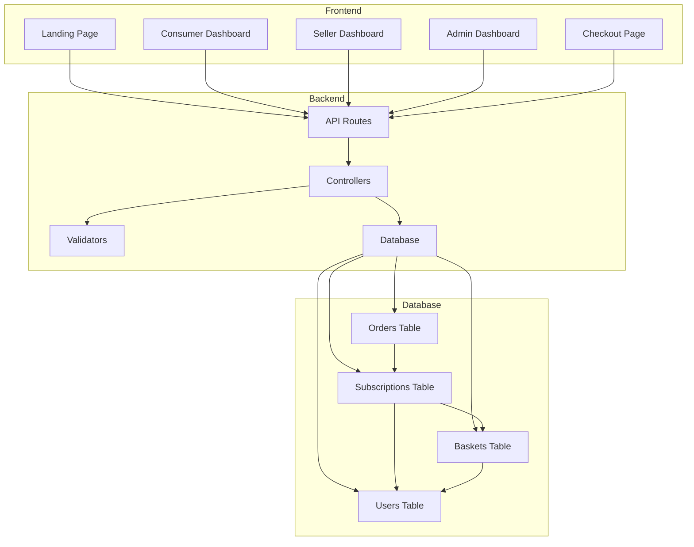

# Hoby Loop MVP - Requirements Analysis & Implementation Plan

## Executive Summary

This document analyzes the current implementation of the Hoby Loop MVP against stated requirements and provides a comprehensive plan to bring the project into full compliance with the minimum viable product specifications.

## Current State Analysis

### ✅ What's Working

1. **User Management**
   - Three user roles implemented: `consumer`, `seller`, `admin`
   - Basic authentication system in place
   - User registration flows for sellers and consumers
   - CPF and CNPJ fields exist in the database model

2. **Core Entities**
   - [`models.User`](models/models.go:8) - User accounts with role-based access
   - [`models.Basket`](models/models.go:32) - Product offerings from sellers
   - [`models.Subscription`](models/models.go:41) - Consumer subscriptions to baskets
   - [`models.Order`](models/models.go:52) - Delivery orders for subscriptions

3. **Admin Dashboard**
   - View all users, subscriptions, and baskets
   - Statistics dashboard with counts
   - Role-based access control via middleware

4. **Seller Dashboard**
   - View clients (subscribers)
   - View products (baskets)
   - Copy subscription links

5. **Consumer Dashboard**
   - View active subscriptions
   - See basket details and pricing

---

## ❌ Missing Requirements

### 1. **Order Status Icons on Consumer Dashboard**

**Requirement:** User page should show subscriptions with icons displaying order status (preparing, shipped, delivered)

**Current State:** 
- [`ConsumerDashboard.jsx`](frontend/src/pages/ConsumerDashboard.jsx:1) only shows subscription status, not individual order statuses
- No visual icons for order tracking
- No relationship between subscriptions and their orders displayed

**Gap:** Consumers cannot see the delivery status of their orders

---

### 2. **Seller Order Fulfillment View**

**Requirement:** Store page where sellers can click on basket cards to see orders they need to fulfill

**Current State:**
- [`SellerDashboard.jsx`](frontend/src/pages/SellerDashboard.jsx:1) shows baskets but clicking them only copies a link
- No view to see pending orders for each basket
- No way to update order status

**Gap:** Sellers have no way to manage order fulfillment

---

### 3. **CPF/CNPJ Validation & Payment Processing**

**Requirement:** Database should store standard CPF and CNPJ information for Brazilian payment and tax processing

**Current State:**
- Fields exist in [`models.User`](models/models.go:8) but no validation
- No format validation (CPF: 11 digits, CNPJ: 14 digits)
- No uniqueness constraints
- No validation for proper formatting (XXX.XXX.XXX-XX for CPF, XX.XXX.XXX/XXXX-XX for CNPJ)

**Gap:** Data integrity issues and inability to properly process payments/taxes

---

### 4. **Order Status Workflow**

**Requirement:** Orders should have clear status progression (preparing → shipped → delivered)

**Current State:**
- [`CreateOrderInput`](internal/controllers/order_controller.go:13) accepts status but uses generic values: "Processing", "Shipped", "Delivered", "Cancelled"
- No API endpoint to update order status
- No validation of status transitions
- No automatic order creation when subscriptions are made

**Gap:** Incomplete order lifecycle management

---

### 5. **Admin Store & User Management**

**Requirement:** Administrator page can see both stores and users with their respective information

**Current State:**
- [`AdminDashboard.jsx`](frontend/src/pages/AdminDashboard.jsx:1) shows users and baskets separately
- No consolidated "store" view showing seller + their baskets + their orders
- Limited user detail information displayed

**Gap:** Admin cannot effectively oversee store operations

---

## 🗑️ Code Quality Issues

### Unused/Trash Code

1. **Debug Print Statements**
   - [`admin_controller.go`](internal/controllers/admin_controller.go:22) - Multiple `fmt.Printf` debug statements
   - Should be replaced with proper logging

2. **Hardcoded Values**
   - [`ConsumerCheckout.jsx`](frontend/src/pages/ConsumerCheckout.jsx:29) - Hardcoded user_id: 10
   - Should use authenticated user

3. **Inconsistent API Endpoints**
   - Consumer subscriptions endpoint: `/users/:id/subscriptions` (line 48 in routes)
   - But frontend calls: `/consumers/:id/subscriptions` (ConsumerDashboard line 21)
   - **This is a bug that needs fixing**

4. **Incomplete Features**
   - [`ConsumerCheckout.jsx`](frontend/src/pages/ConsumerCheckout.jsx:55) - Dropdown menus are visual only, not functional
   - Address and payment forms don't actually save data

5. **Missing Error Handling**
   - Many API calls use simple `console.error` or `alert`
   - No proper error boundaries or user feedback

---

## 📋 Implementation Plan

### Phase 1: Database & Backend Enhancements

#### 1.1 Add CPF/CNPJ Validation

**Files to modify:**
- [`models/models.go`](models/models.go:1)
- Create new file: `internal/validators/document_validator.go`

**Changes:**
```go
// Add validation tags and uniqueness constraints
CPF  string `json:"cpf,omitempty" gorm:"unique;index" validate:"cpf"`
CNPJ string `json:"cnpj,omitempty" gorm:"unique;index" validate:"cnpj"`

// Create validator functions
- ValidateCPF(cpf string) bool
- ValidateCNPJ(cnpj string) bool
- FormatCPF(cpf string) string
- FormatCNPJ(cnpj string) string
```

#### 1.2 Enhance Order Model

**Files to modify:**
- [`models/models.go`](models/models.go:52)

**Changes:**
```go
type Order struct {
    gorm.Model
    SubscriptionID uint         `json:"subscription_id"`
    Subscription   Subscription `json:"subscription,omitempty"`
    Status         string       `json:"status"` // "preparing", "shipped", "delivered"
    TrackingCode   string       `json:"tracking_code,omitempty"`
    ShippedAt      *time.Time   `json:"shipped_at,omitempty"`
    DeliveredAt    *time.Time   `json:"delivered_at,omitempty"`
}
```

#### 1.3 Add Order Management Endpoints

**Files to modify:**
- [`internal/routes/routes.go`](internal/routes/routes.go:1)
- [`internal/controllers/order_controller.go`](internal/controllers/order_controller.go:1)

**New endpoints:**
```
GET    /subscriptions/:id/orders          - Get all orders for a subscription
GET    /baskets/:id/orders                - Get all orders for a basket (seller view)
PUT    /orders/:id/status                 - Update order status
GET    /orders/:id                        - Get single order details
```

#### 1.4 Fix API Endpoint Inconsistency

**Files to modify:**
- [`internal/routes/routes.go`](internal/routes/routes.go:48)

**Change:**
```go
// Fix: Change from /users/:id/subscriptions to /consumers/:id/subscriptions
r.GET("/consumers/:id/subscriptions", controllers.GetConsumerSubscriptions)
```

---

### Phase 2: Frontend Enhancements

#### 2.1 Consumer Dashboard - Add Order Status Icons

**Files to modify:**
- [`frontend/src/pages/ConsumerDashboard.jsx`](frontend/src/pages/ConsumerDashboard.jsx:1)
- [`frontend/src/i18n/pt-BR.js`](frontend/src/i18n/pt-BR.js:1)

**Changes:**
- Fetch orders for each subscription
- Display order status with icons:
  - 📦 Preparing (preparing)
  - 🚚 Shipped (shipped)
  - ✅ Delivered (delivered)
- Show most recent order status per subscription
- Add expandable view to see order history

#### 2.2 Seller Dashboard - Add Order Fulfillment View

**Files to modify:**
- [`frontend/src/pages/SellerDashboard.jsx`](frontend/src/pages/SellerDashboard.jsx:1)
- Create new file: `frontend/src/pages/SellerOrderManagement.jsx`
- [`frontend/src/App.jsx`](frontend/src/App.jsx:1)

**Changes:**
- Make basket cards clickable to navigate to order management
- Create new page showing:
  - All orders for selected basket
  - Order status with ability to update
  - Customer information
  - Delivery address
- Add status update buttons (Mark as Shipped, Mark as Delivered)

#### 2.3 Admin Dashboard - Enhanced Store View

**Files to modify:**
- [`frontend/src/pages/AdminDashboard.jsx`](frontend/src/pages/AdminDashboard.jsx:1)

**Changes:**
- Add "Stores" tab showing:
  - Seller information (name, CNPJ)
  - Number of baskets
  - Number of active subscriptions
  - Total revenue
- Add drill-down capability to see store details
- Display CPF/CNPJ information in user details

#### 2.4 Fix Checkout Page

**Files to modify:**
- [`frontend/src/pages/ConsumerCheckout.jsx`](frontend/src/pages/ConsumerCheckout.jsx:1)

**Changes:**
- Remove hardcoded user_id
- Use authenticated user from localStorage
- Make dropdowns functional (frequency selection)
- Validate CPF format before submission
- Save address information to user profile

---

### Phase 3: Code Quality & Refactoring

#### 3.1 Remove Debug Code

**Files to modify:**
- [`internal/controllers/admin_controller.go`](internal/controllers/admin_controller.go:1)

**Changes:**
- Replace `fmt.Printf` with proper structured logging
- Use a logging library (e.g., `logrus` or `zap`)

#### 3.2 Implement Proper Error Handling

**Files to create:**
- `frontend/src/utils/errorHandler.js`
- `frontend/src/components/ui/ErrorBoundary.jsx`
- `frontend/src/components/ui/Toast.jsx`

**Changes:**
- Create centralized error handling utility
- Add toast notifications for user feedback
- Implement error boundaries for React components

#### 3.3 Add Input Validation

**Files to create:**
- `frontend/src/utils/validators.js`

**Changes:**
- CPF validation function
- CNPJ validation function
- Email validation
- Phone number validation (Brazilian format)
- CEP validation

#### 3.4 Standardize API Calls

**Files to modify:**
- [`frontend/src/config/api.js`](frontend/src/config/api.js:1)

**Changes:**
- Create axios instance with interceptors
- Centralize all API endpoints
- Add authentication headers automatically
- Handle token refresh
- Standardize error responses

#### 3.5 Code Organization

**Files to refactor:**
- All controller files
- All frontend page components

**Changes:**
- Extract business logic from controllers into service layer
- Create reusable UI components for common patterns
- Separate concerns (data fetching, state management, presentation)
- Add PropTypes or TypeScript for type safety

---

## 🔄 Migration Strategy

### Database Migrations

1. **Add uniqueness constraints to CPF/CNPJ**
2. **Add new Order fields** (TrackingCode, ShippedAt, DeliveredAt)
3. **Create indexes** for performance

### Data Validation

1. **Validate existing CPF/CNPJ data**
2. **Clean up invalid entries**
3. **Add validation middleware** for all user creation/update endpoints

---

## 📊 System Architecture Diagram



---

## 🎯 Priority Matrix

### High Priority (MVP Blockers)
1. ✅ Fix API endpoint inconsistency (consumers vs users)
2. ✅ Add order status tracking to consumer dashboard
3. ✅ Add order fulfillment view for sellers
4. ✅ Implement CPF/CNPJ validation

### Medium Priority (MVP Enhancement)
5. ✅ Remove hardcoded values in checkout
6. ✅ Add proper error handling
7. ✅ Remove debug print statements
8. ✅ Enhance admin store view

### Low Priority (Post-MVP)
9. Add comprehensive logging
10. Implement automated testing
11. Add performance monitoring
12. Implement email notifications

---

## 📝 Detailed Task Breakdown

### Task 1: Fix API Endpoint Bug
**File:** [`internal/routes/routes.go`](internal/routes/routes.go:48)
**Change:** Update route from `/users/:id/subscriptions` to `/consumers/:id/subscriptions`
**Impact:** Critical - Frontend is currently broken

### Task 2: Add CPF/CNPJ Validation
**Files:** 
- Create `internal/validators/document_validator.go`
- Modify [`models/models.go`](models/models.go:16)
- Modify [`internal/controllers/user_controller.go`](internal/controllers/user_controller.go:1)

**Implementation:**
```go
// Validation functions
func ValidateCPF(cpf string) bool {
    // Remove non-numeric characters
    cpf = regexp.MustCompile(`\D`).ReplaceAllString(cpf, "")
    
    // Check length
    if len(cpf) != 11 {
        return false
    }
    
    // Check for known invalid CPFs
    invalid := []string{"00000000000", "11111111111", ...}
    for _, inv := range invalid {
        if cpf == inv {
            return false
        }
    }
    
    // Calculate verification digits
    // ... (implement CPF algorithm)
    
    return true
}

func ValidateCNPJ(cnpj string) bool {
    // Similar implementation for CNPJ
    // ... (implement CNPJ algorithm)
}
```

### Task 3: Enhance Order Model
**File:** [`models/models.go`](models/models.go:52)

**Add fields:**
```go
TrackingCode   string     `json:"tracking_code,omitempty"`
ShippedAt      *time.Time `json:"shipped_at,omitempty"`
DeliveredAt    *time.Time `json:"delivered_at,omitempty"`
```

### Task 4: Create Order Management Endpoints
**File:** [`internal/controllers/order_controller.go`](internal/controllers/order_controller.go:1)

**New functions:**
```go
func GetSubscriptionOrders(c *gin.Context)
func GetBasketOrders(c *gin.Context)
func UpdateOrderStatus(c *gin.Context)
func GetOrder(c *gin.Context)
```

### Task 5: Update Consumer Dashboard
**File:** [`frontend/src/pages/ConsumerDashboard.jsx`](frontend/src/pages/ConsumerDashboard.jsx:1)

**Add:**
- Fetch orders for each subscription
- Display order status icons
- Show order tracking information
- Add order history expandable section

### Task 6: Create Seller Order Management Page
**New file:** `frontend/src/pages/SellerOrderManagement.jsx`

**Features:**
- Display all orders for a specific basket
- Show customer details
- Update order status buttons
- Filter by order status
- Search functionality

### Task 7: Enhance Admin Dashboard
**File:** [`frontend/src/pages/AdminDashboard.jsx`](frontend/src/pages/AdminDashboard.jsx:1)

**Add:**
- Stores tab with seller aggregated data
- Display CPF/CNPJ in user details
- Add store performance metrics
- Drill-down capability

### Task 8: Remove Debug Code
**File:** [`internal/controllers/admin_controller.go`](internal/controllers/admin_controller.go:22)

**Replace:**
```go
// Remove these
fmt.Printf("Admin users request - Header X-User-ID: %s, Found %d users\n", userID, len(users))

// Add proper logging
log.WithFields(log.Fields{
    "user_id": userID,
    "count": len(users),
}).Info("Admin users request")
```

### Task 9: Fix Checkout Hardcoded Values
**File:** [`frontend/src/pages/ConsumerCheckout.jsx`](frontend/src/pages/ConsumerCheckout.jsx:29)

**Change:**
```javascript
// Remove hardcoded user_id
const user = JSON.parse(localStorage.getItem('user'))
axios.post('http://localhost:8080/subscriptions', {
    user_id: user.ID,  // Use authenticated user
    basket_id: parseInt(id),
    frequency: selectedFrequency  // Make this dynamic
})
```

### Task 10: Implement Error Handling
**New files:**
- `frontend/src/utils/errorHandler.js`
- `frontend/src/components/ui/Toast.jsx`

**Features:**
- Centralized error handling
- User-friendly error messages
- Toast notifications
- Error logging

---

## 🧪 Testing Strategy

### Backend Testing
1. Unit tests for CPF/CNPJ validators
2. Integration tests for order management endpoints
3. API endpoint tests for all CRUD operations

### Frontend Testing
1. Component tests for new UI elements
2. Integration tests for user flows
3. E2E tests for critical paths:
   - Consumer viewing orders
   - Seller updating order status
   - Admin viewing store information

---

## 📈 Success Metrics

### Functional Completeness
- ✅ All MVP requirements implemented
- ✅ No critical bugs
- ✅ All user roles can perform their tasks

### Code Quality
- ✅ No debug code in production
- ✅ Proper error handling throughout
- ✅ Consistent code style
- ✅ No hardcoded values

### Data Integrity
- ✅ CPF/CNPJ validation working
- ✅ Unique constraints enforced
- ✅ Proper data relationships

---

## 🚀 Deployment Checklist

- [ ] Run database migrations
- [ ] Validate existing data
- [ ] Update environment variables
- [ ] Deploy backend changes
- [ ] Deploy frontend changes
- [ ] Run smoke tests
- [ ] Monitor error logs
- [ ] Verify all user flows

---

## 📚 Additional Recommendations

### Security Enhancements
1. Implement rate limiting
2. Add CSRF protection
3. Sanitize all user inputs
4. Implement proper session management
5. Add API key authentication for admin endpoints

### Performance Optimizations
1. Add database indexes
2. Implement caching for frequently accessed data
3. Optimize database queries (use joins instead of N+1)
4. Add pagination for large lists
5. Implement lazy loading for images

### User Experience
1. Add loading states for all async operations
2. Implement optimistic UI updates
3. Add confirmation dialogs for destructive actions
4. Improve mobile responsiveness
5. Add keyboard shortcuts for power users

---

## 📞 Next Steps

1. **Review this plan** with stakeholders
2. **Prioritize tasks** based on business needs
3. **Assign tasks** to development team
4. **Set timeline** for each phase
5. **Begin implementation** starting with high-priority items

